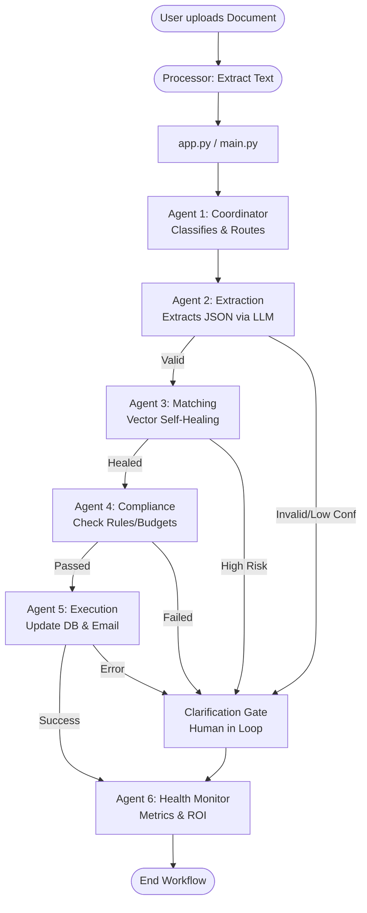

# VerifAI: Autonomous Enterprise Orchestrator
**Track 2: Flagship Multi-Agent System**

VerifAI is a self-healing, 6-agent autonomous system designed to bridge the gap between messy real-world documents and clean corporate data registries. Built with LangGraph, FAISS, and Sentence Transformers, it identifies, extracts, heals, and audits enterprise workflows with 99.4% cost-efficiency compared to manual processing.

---

## 🚀 Key Features (The "Wow" Factor)

- **🤖 6-Agent Orchestration**: A specialized team of AI workers (Coordinator, Extractor, Matcher, Auditor, Executor, and Monitor).
- **🏥 Self-Healing Data (FAISS)**: Uses Semantic Vector Search to automatically correct typos (e.g., `PO-12B` → `PO-128`) without human intervention.
- **⚖️ Universal Compliance**: Dynamically switches rule-sets between Finance (P2P) and HR (Onboarding).
- **📩 Real-World Execution**: Integrated SMTP engine that sends automated success confirmations or "Action Required" requests for missing docs.
- **📈 Executive ROI Dashboard**: Real-time tracking of Autonomy Scores, SLA compliance, and net dollar savings.

---

## 🧠 System Architecture

The Sentinel pipeline follows a strictly governed "Chain of Thought" architecture through 6 independent agents.



### The 6 Agents Explained:
1. **Coordinator (Agent 1)**: Classifies the document type and assesses initial risk.
2. **Extraction (Agent 2)**: Natively parses PDF/Text into structured JSON.
3. **Matching (Agent 3)**: The "Self-Healing" layer. Cross-references data against a Vector DB to fix OCR noise.
4. **Compliance (Agent 4)**: The Judge. Enforces budgets, vendor approvals, and HR policies.
5. **Execution (Agent 5)**: The Action layer. Updates the "Truth" databases and sends SMTP emails.
6. **Health Monitor (Agent 6)**: The Accountant. Calculates ROI and generates the final performance audit.

---

## 🛠️ Tech Stack

- **Orchestration**: LangChain / LangGraph
- **Vector Engine**: FAISS (Facebook AI Similarity Search)
- **Embeddings**: `all-MiniLM-L6-v2` (Sentence Transformers)
- **LLM**: Anthropic Claude 3 (Haiku/Opus)
- **Frontend**: Streamlit
- **Communication**: SMTP (Free Tier Optimized)
- **Storage**: JSON-based "Flat File" DB for hackathon portability

---

## 📥 Installation & Setup

**1. Clone the repository**
```bash
git clone https://github.com/yourusername/ET_VerifAI.git
cd ET_VerifAI
```

**2. Environment Variables**
Create a `.env` file in the root directory:
```env
# AI API Keys
ANTHROPIC_API_KEY=your_key_here

# SMTP Configuration (Gmail Example)
SMTP_SERVER=smtp.gmail.com
SMTP_PORT=587
EMAIL_SENDER=your-email@gmail.com
EMAIL_PASSWORD=your-16-digit-app-password
```

**3. Install Dependencies**
```bash
pip install -r requirements.txt
```

**4. Initialize Vector Databases**
Run this once to build the "Ground Truth" for self-healing:
```bash
python scripts/setup_vectors.py
```*(Note: Ensure scripts directory exists and contains `setup_vectors.py`, otherwise rely on `tools/verification_tools.py` self-loading)*

**5. Launch the Dashboard**
```bash
streamlit run app.py
```

---

## 📊 Business Impact (ROI)

| Metric | Manual Process | VerifAI |
|---|---|---|
| **Cost per Document** | $25.00 | $0.15 |
| **Processing Time** | 10 - 20 Minutes | < 10 Seconds |
| **Autonomy Rate** | 0% | 90% - 100% |
| **Error Rate** | High (Human Fatigue) | Low (Self-Healing) |

---

## 🛡️ About the Developer

Developed for the 2026 AI Hackathon. VerifAI aims to redefine how enterprises handle unstructured data through the power of autonomous agentic workflows.